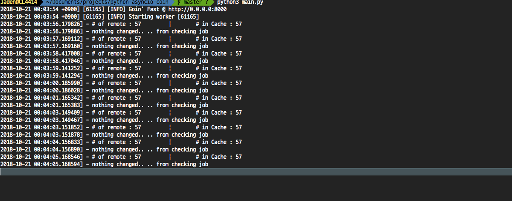

# python-asyncio-coin

Requirements

1. bithumb API Key, Secret key
2. pybithumb
3. pandas lib 
4. Sanic framework

 

Install.
1. issue API and secret key from bithumb.co.kr
2. pip install -U pybithumb
3. pip install pandas
4. pip install sanic

Execute.

python3 main.py #in project directory

